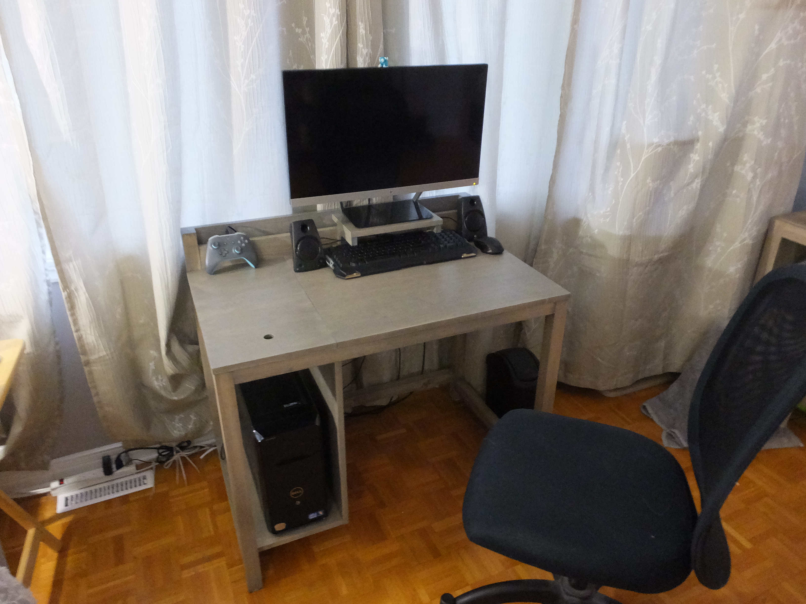
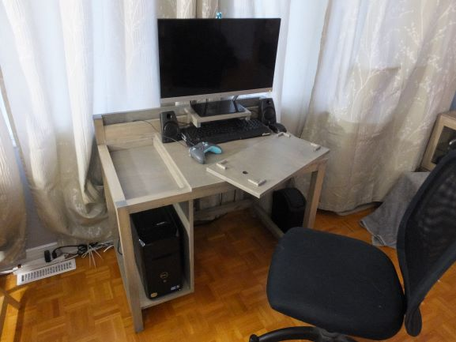

# Bureau d'ordinateur
Un petit bureau d'ordinateur (code de projet CD1) avec un compartiment dissimulé dans le plan de travail inspiré du projet "Small Computer Desk" de [Build Something](https://www.buildsomething.com/plans/PB3DC397A2732E8EE/Small-Computer-Desk).

 

# Matériaux
Si vous ne faites aucune erreur de coupe, vous aurez besoin de :

* (1) goujon carré 3/8"x3/8"x4'
* (1) goujon carré 3/4"x3/4"x4'
* (4) latte 1 1/2"x1 1/2"x8'
* (1) planche 3/4"x3 1/2"x8'
* (1) feuille de contre-plaqué 3/4"x4'x8'
* (2) bande de chant 13/16"x25'

# Quincaillerie
* Colle à bois
* Vis pour trou en angle #8 2 1/2"
* Vis pour trou en angle #8 1"
* Vis à bois à tête plate #8 1 1/4"

# Outils nécessaires
Hormis les outils de base (p. ex. ruban à mesurer), vous aurez également besoin de :

* Gabarit pour faire des trous en angle;
* Perceuse/visseuse;
* Scie circulaire pour découper les panneaux;
* Scie à onglet pour découper précisement les lattes et les planches.

# Liste des documents
* CD1-ASY-001.pdf : dessin d'ensemble du projet avec la liste des pièces;
* CD1-ASY-002.pdf : dessin d'assemblage par étapes;
* CD1-MFG-001.pdf : le plan de coupe;
* CD1-MFG-001.pdf : le coût du projet;
* CD1-PRT-XYZ.pdf : le dessin de définition de la pièce numéro XYZ (notez que les pièces triviales n'ont pas de dessin de définition);
* CD1-REQ-001.pdf : le cahier des charges du bureau.

# Environnement de développement
* Windows 10 comme système d'exploitation;
* QCAD Professional pour les dessins techniques;
* LibreOffice 6.3.6 pour les documents;
* PDFtk pour manipuler les fichiers PDF;
* MinGW (mingw32-base-bin 2013072200) pour les outils de développement de base.

# Construire les artefacts
Avec l'environnement de développement correct, il vous suffit de lancer la commande "make" depuis une invite de commande cmd.exe à la racine du projet et les documents seront générés dans le répertoire "build".

En cas d'erreurs "'X' n'est pas reconnu en tant que commande interne ou externe [...]", vérifiez que les exécutables de LibreOffice, QCAD, PDFtk et MinGW sont dans votre PATH.
